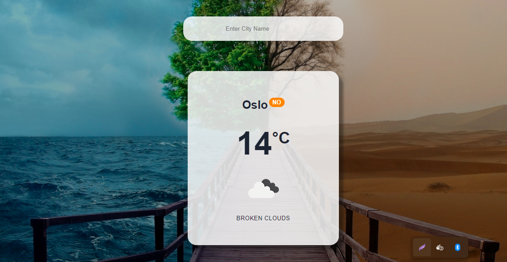
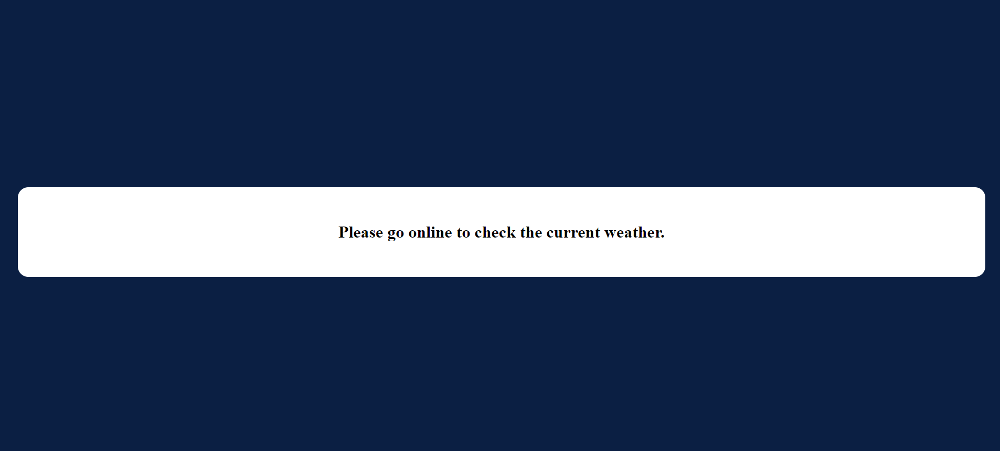

# Weather Progressive Web Application 

<div style="text-align:center;margin:30px auto;">
  
</div>
<div style="text-align:center;margin:30px auto;">
  
</div>

## Usage
Using custom service workers and a JSON Manifest
Progressive Web Apps provide a unique opportunity to deliver a web experience that users will love. 
Native-like capabilities and reliability allow App to be installed, anywhere, on any device.

### Install dependencies:

```bash
npm install
```
## Add Environment Variables:

Rename the `.env.example` file to `.env` and add your api key to REACT_APP_WEATHER_API_KEY:


Run the development server:

```bash
npm run dev
```

Open [http://localhost:3000](http://localhost:3000) with your browser to see the result.